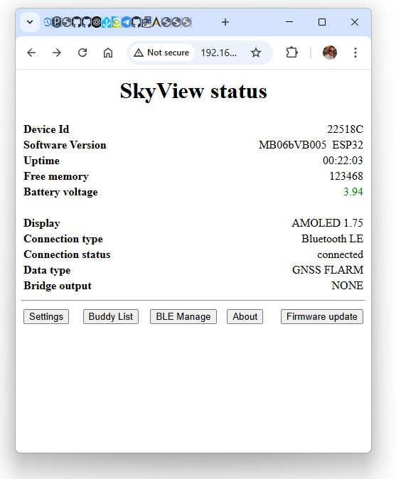
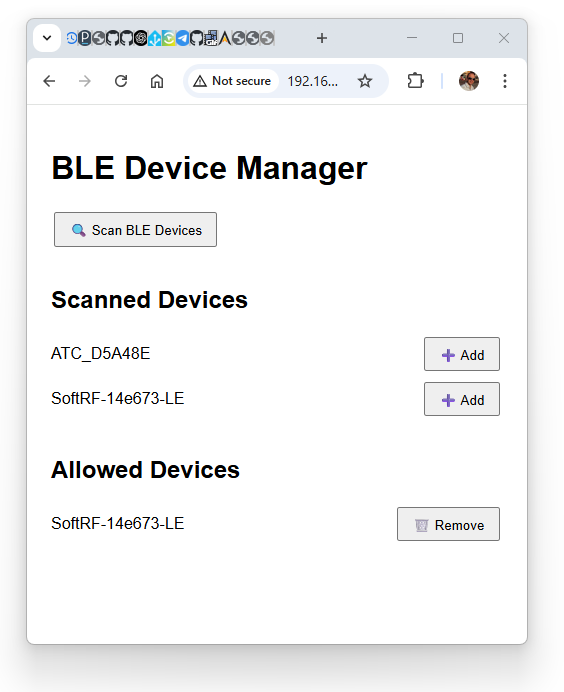

### Release VB005

Improved Mode/Power button. Long press to start / Long press to shutdown 
Bluetooth Connections are managed, SkyView will only connect to the paired devices.
Unlike before it was connecting to any vario.

---
## What's New in VB005

**BLE Connection Managed**

- SkyView now only connects to the **Paired BLE devices** (unlike before, it would connect to any Bluetooth device, which could cause issues on a busy takeoff).
- To pair your SoftRF via bluetooth. 
1. **Connect to SkyView WiFi**
    - Power on your SkyView device.
    - Connect your computer or phone to the SkyView WiFi access point (available for 10 minutes after powering on). **Default password: 12345678**

2. **Access the Web Interface**
    - Open your web browser.
    - Navigate to [http://192.168.1.1](http://192.168.1.1).

    
 2. **Click BLE Manage button.**
  - Click Scan BLE devices.
  - Pick your SoftRF and click Add button.
  - That's all
> **Note:** You can also Remove previously paired devices on the same page.

---

**Improved Mode/Power Button Functionality**

- **To Power Off:** Long press when device is on.
- **To Power On** Long press ( >2 seconds) whils device in sleep mode.
- The device will not be accidentally powered on by momentarily pressing the button.
---
- **Short press (during normal operation):** Cycles through the screens in order: Radar → Traffic Info → Compass → Radar.
> **Note:** If you disable the Compass page in Settings, the screen will simply alternate between Radar ⇄ Traffic Info pages.

---

***Easy Firmware Update***

- Watch the video above for instructions on how to **update SkyView firmware** via the built-in **Web Interface**.  
    https://youtu.be/NbYAM7KYvmo

Link to the new Firmware:  

 
[SkyView_firmware_VB005.bin](https://github.com/slash-bit/SkyView-AMOLED-round-1.75-TFT_eSPI/blob/main/binaries/SkyView_firmware_VB005.bin)

---

